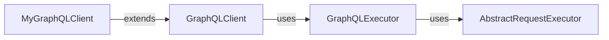

[](https://search.maven.org/artifact/com.expediagroup/expediagroup-sdk-graphql)

# Expedia Group JVM SDK - GraphQL Module
Building an SDK for GraphQL APIs presents unique challenges, such as defining the schema, constructing queries and mutations, and generating models. To address these requirements, this module was built as an extension package that adds GraphQL API support using Apollo Kotlin.

Product SDKs that require GraphQL capabilities simply include this extension dependency, and Maven or Gradle will automatically pull in the core module transitively.

## Installation

_The `expediagroup-sdk-graphql` requires Java 8 or higher._

<details>
  <summary><strong>Maven</strong></summary>

  Add the `expediagroup-sdk-graphql` as a dependency in your `pom.xml`:

  ```xml
  <dependency>
    <groupId>com.expediagroup</groupId>
    <artifactId>expediagroup-sdk-graphql</artifactId>
    <version>{latest-version}</version>
  </dependency>
  ```
</details>


<details>
  <summary><strong>Gradle</strong></summary>

  Add the `expediagroup-sdk-graphql` as a dependency in your `build.gradle`:

  ```gradle
  implementation 'com.expediagroup:expediagroup-sdk-graphql:{latest-version}'
  ```
</details>

## Architecture & Components
The GraphQL module builds on the core abstractions to streamline GraphQL client setup and provides a compatibility layer that adapts Apollo Kotlin–generated operations to the core request/response pipeline with minimal configuration.

### Apollo Kotlin Integration
It's important to highlight that the GraphQL module depends only on the Apollo Kotlin API and its code-generation plugin and **not** on Apollo’s HTTP engine. This enables the SDK to work seamlessly with Apollo-generated operation classes and models while delegating all HTTP requests to its own transport layer. Meanwhile, Apollo remains responsible for serializing queries and deserializing responses, ensuring type-safe handling of the GraphQL payloads.

### GraphQL Clients
The GraphQL module provides a high-level abstract class, `GraphQLClient`, which serves as the integration point between your product SDK and the core SDK internals (executors, transports, etc.). 

When you instantiate a `GraphQLClient`, you need to supply a `GraphQLExecutor` instance — a component responsible for orchestrating request execution and mapping errors to the SDK’s exception model. Under the hood, the `GraphQLExecutor` delegates to an `AbstractRequestExecutor` implementation from the core module, where you configure your request pipeline (authentication, logging, masking, etc.).



### GraphQL Responses Processing
In GraphQL, API responses fall into four categories:
| Response Type                 | Description                                                                          |
|-------------------------------|--------------------------------------------------------------------------------------|
| Successful response           | All requested data is returned.                                                      |
| Partial response              | Some fields resolve successfully while others fail.                                  |
| Error response (no data)      | The server processes the request but returns errors for every field, yielding no data. |
| Exception response            | A transport or server error occurs, and no GraphQL payload is returned.              |


Because GraphQL always uses an HTTP `2xx` status code, the SDK applies its own conventions in the `GraphQLExecutor` to make responses predictable:
| Response Type                 | SDK Behavior                                                                                          |
|-------------------------------|-------------------------------------------------------------------------------------------------------|
| Exception response            | Throws an `ExpediaGroupServiceException`.                                                             |
| Partial response              | Returns a `RawResponse` containing both the successfully resolved data and the error list.            |
| Error response (no data)      | Throws a `NoDataException`, including the full response payload.                                      |
| Successful response           | Returns a `RawResponse` with the data and an empty error list.                                        |

  
While similar to Apollo’s handling, this approach - especially throwing exceptions when no data is present — aligns with the broader SDK design and provides a consistent error‐handling model.

### Pagination
To simplify working with cursor or offset‐based GraphQL pagination, the SDK provides two abstract utilities:

##### 1. PaginatedStream

A lazy, sequential stream of items from any paginated data source.  

**How it works**:  
- Internally buffers one “page” of results at a time in a `Deque`.  
- Calls your implementation of `fetchNextPage(): List<T>?` whenever the buffer is empty.  
- Exposes a Java `Stream<T>` via `stream()`, so you can consume items one by one, without worrying about page boundaries.


##### 2. Paginator
A simple iterator‐style helper for paging through GraphQL responses that include both data and pageInfo in their model.

**Responsibilities:**
- Tracks whether more pages remain via your `hasPagesToFetch()` implementation.
- Implements the `Iterator<T>` interface
- `hasNext()` returns true until no further pages remain.
- `next()` should be provided by your subclass to fetch each page’s `PaginatedResponse`.


