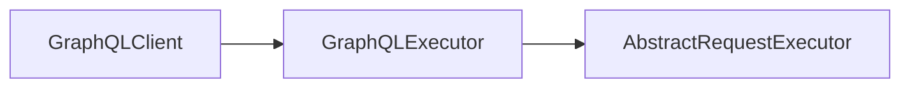

[](https://search.maven.org/artifact/com.expediagroup/expediagroup-sdk-graphql)

# Expedia Group JVM SDK - GraphQL Module
Building an SDK for GraphQL APIs presents unique challenges, such as defining the schema, constructing queries and mutations, and generating models. To address these requirements, this module was built as an extension package that adds GraphQL API support using Apollo Kotlin.

Product SDKs that require GraphQL capabilities simply include this extension dependency, and Maven or Gradle will automatically pull in the core module transitively.

## Installation

_The `expediagroup-sdk-graphql` requires Java 8 or higher._

<details>
  <summary><strong>Maven</strong></summary>

  Add the `expediagroup-sdk-graphql` as a dependency in your `pom.xml`:

  ```xml
  <dependency>
    <groupId>com.expediagroup</groupId>
    <artifactId>expediagroup-sdk-graphql</artifactId>
    <version>{latest-version}</version>
  </dependency>
  ```
</details>


<details>
  <summary><strong>Gradle</strong></summary>

  Add the `expediagroup-sdk-graphql` as a dependency in your `build.gradle`:

  ```gradle
  implementation 'com.expediagroup:expediagroup-sdk-graphql:{latest-version}'
  ```
</details>

## Architecture & Components
The GraphQL module builds on the core abstractions to streamline GraphQL client setup and provides a compatibility layer that adapts Apollo Kotlin–generated operations to the core request/response pipeline with minimal configuration.

### Apollo Kotlin Integration
It's important to highlight that the GraphQL module depends only on the Apollo Kotlin API and its code-generation plugin and **not** on Apollo’s HTTP engine. This enables the SDK to work seamlessly with Apollo-generated operation classes and models while delegating all HTTP requests to its own transport layer. Meanwhile, Apollo remains responsible for serializing queries and deserializing responses, ensuring type-safe handling of the GraphQL payloads.

TODO: ADD Usage Example Document

### GraphQL Clients
The GraphQL module provides a high-level abstract class, `GraphQLClient`, which serves as the integration point between your product SDK and the core SDK internals (executors, transports, etc.). 

When you instantiate a `GraphQLClient`, you need to supply a `GraphQLExecutor` instance — a component responsible for orchestrating request execution and mapping errors to the SDK’s exception model. Under the hood, the `GraphQLExecutor` delegates to an `AbstractRequestExecutor` implementation from the core module, where you configure your request pipeline (authentication, logging, masking, etc.).



### GraphQL Responses Processing

### Error Handling

### Pagination


